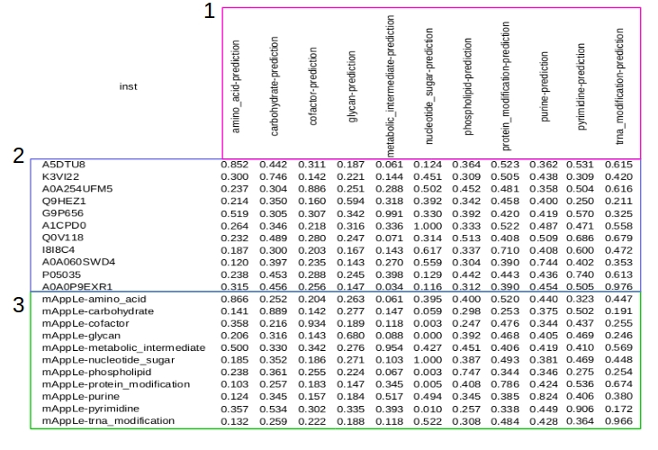

Based on machine learning approach, this tool is use to predict metabolic pathway of enzymes.
 

### Tutorial

To use mAppLe tool, you will need:

- OS Linux (tested with Ubuntu 18.04)
- R 3.6.0 or higher
- Memory RAM: 8GB or higher
- MultiCore processor
 

Download the file [mApLe.tar.xz](https://drive.google.com/open?id=1xZG2EPV2IkBLWOlBoiRkauXaUlJGvS24) and uncompress in /home/USER

Follow the instructions in README.txt

 
 

### About mAppLe
You can visualize the prediction table, plot and a summary of data in mAppLe tool.
 
You can download (as compressed file) the results:
- Table of Results;
- Weka files results;
- Plots;
- ARFF files used;
- Attributes generated.
 
 
Table of results will show like the follow figure:  
 

 
1 - Metabolic pathways analysed. 
2 - Identification of sequences and probability results. 
3 - Sequence control of mApLe tool and probability results. 
 
